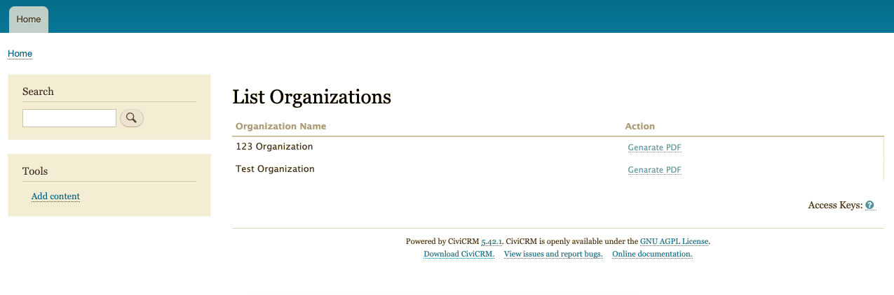

# com.epit.membersbyorganizations



Get list of organization's members and create a PDF file.

The extension is licensed under [AGPL-3.0](./LICENSE.txt).

## Requirements

* PHP v7.2+
* CiviCRM v5.40+

## Installation (Web UI)

Learn more about installing CiviCRM extensions in the [CiviCRM Sysadmin Guide](https://docs.civicrm.org/sysadmin/en/latest/customize/extensions/).

## Installation (CLI, Zip)

Sysadmins and developers may download the `.zip` file for this extension and
install it with the command-line tool [cv](https://github.com/civicrm/cv).

```bash
cd <extension-dir>
cv dl com.epit.membersbyorganizations@https://github.com/vinay-osseed/com.epit.membersbyorganizations/archive/master.zip
```

## Installation (CLI, Git)

Sysadmins and developers may clone the [Git](https://en.wikipedia.org/wiki/Git) repo for this extension and
install it with the command-line tool [cv](https://github.com/civicrm/cv).

```bash
git clone https://github.com/vinay-osseed/com.epit.membersbyorganizations.git
cv en membersbyorganizations
```

## Getting Started

1. After installing the extension can list the `organzaions` from contats here `/civicrm/list-org` or can use menu from `Contcats > List Organizations`.

2. This extension create a new `Employee List of Orgnization` message template in CiviCRM to extend the `Contributions - Invoice`.

3. On this `List Organizations` page you can see list of organizations with `Genarate PDF` button in front of each organization to create a PDF file containing the list of all members of orgazation to download.

4. When a new contribution is added for an organization, an extra page which lists (in alphabetical order of last_name) the `first name, last name and membership no` of those `Individual Contacts` who are employees of the organization (relationship: employee of) and are `current` or `pending` members.

5. Once contribution invoice is generated, you can send it by email with that extra information of members of organization with it.

## Known Issues
